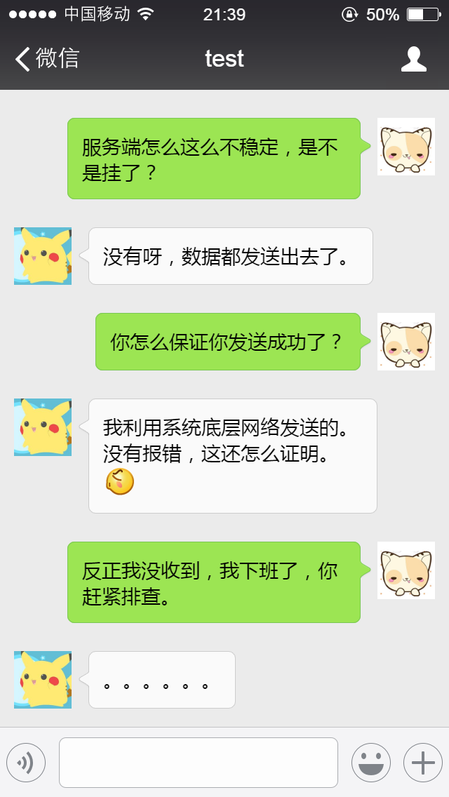

# 第二节：tcpdump

## 1 小对话

## 


## 2 tcpdump 就是证据

  tcpdump - dump traffic on a network

```
tcpdump -i eth0 '(tcp port 9821)' -v  -w dump.pcap （服务器nginx 模拟一次请求）
sz dump.pcap

```

（请在https://github.com/wangcy6/shell_five_minute/tree/master/03_tcpdump下载pcap文件）


> 网络层负责ip数据报的产生以及ip数据包在逻辑网络上的路由转发( 选择哪个路径)
>
> 传输层提供端到端通信服务层次,提供可靠及非可靠连接（保证路径上传输可靠 tcp ）


# 

- TCP序列号（Sequence Number）和确认号（Acknowledgment Number）

> TCP之所以可靠，是因为它保证了传送数据包的顺序
>
> Next sequence number:=Sequence number+len(data)
> Sequence number=Next sequence number
> Acknowledgment number: Sequence number 

为了更好的理解在整个TCP会话期间，TCP序列号和确认号是如何工作的，我们可以使用Wireshark内置的绘制流功能，选择菜单栏中的 **Statistics** ->**Flow Graph...**->**TCP flow** ->**OK**

- 这个是老版本的（Wireshark 1.2.7）


## 3 细节（understanding-tcp-sequence-acknowledgment-numbers的分析）

在TCP通讯中主要有连接的建立、数据的传输、连接的关闭三个过程！

每个过程完成不同的工作，而且序列号和确认号在每个过程中的变化都是不同的。

- 数据传输

  

  

  > 看序列号完整行

  ```
  Packet #4
  This is the first packet in the stream which carries an actual payload (specifically, the client's HTTP request). The sequence number is left at 1, since no data has been transmitted since the last packet in this stream. The acknowledgement number is also left at 1, since no data has been received from the server, either.
  
  Note that this packet's payload is 725 bytes in length.
  
  Packet #5
  This packet is sent by the server solely to acknowledge the data sent by the client in packet #4 while upper layers process the HTTP request. Notice that the acknowledgement number has increased by 725 (the length of the payload in packet #4) to 726; e.g., "I have received 726 bytes so far." The server's sequence number remains at 1.
  
  Packet #6
  This packet marks the beginning of the server's HTTP response. Its sequence number is still 1, since none of its packets prior to this one have carried a payload. This packet carries a payload of 1448 bytes.
  
  Packet #7
  The sequence number of the client has been increased to 726 because of the last packet it sent. Having received 1448 bytes of data from the server, the client increases its acknowledgement number from 1 to 1449.
  
  For the majority of the capture, we will see this cycle repeat. The client's sequence number will remain steady at 726, because it has no data to transmit beyond the initial 725 byte request. The server's sequence number, in contrast, continues to grow as it sends more segments of the HTTP response.
  ```


- 连接


  ```
  Packet #1
  Each side of a TCP session starts out with a (relative) sequence number of zero. Likewise, the acknowledgement number is also zero, as there is not yet a complementary side of the conversation to acknowledge.
  
  (Note: The version of Wireshark used for this demonstration, 1.2.7, shows the acknowledgement number as an apparently random number. This believed to be a software bug; the initial acknowledgement number of a session should always be zero, as you can see from inspecting the hex dump of the packet.)
  
  Packet #2
  The server responds to the client with a sequence number of zero, as this is its first packet in this TCP session, and a relative acknowledgement number of 1. The acknowledgement number is set to 1 to indicate the receipt of the client's SYN flag in packet #1.
  
  Notice that the acknowledgement number has been increased by 1 although no payload data has yet been sent by the client. This is because the presence of the SYN or FIN flag in a received packet triggers an increase of 1 in the sequence. (This does not interfere with the accounting of payload data, because packets with the SYN or FIN flag set do not carry a payload.)
  
  Packet #3
  Like in packet #2, the client responds to the server's sequence number of zero with an acknowledgement number of 1. The client includes its own sequence number of 1 (incremented from zero because of the SYN).
  
  At this point, the sequence number for both hosts is 1. This initial increment of 1 on both hosts' sequence numbers occurs during the establishment of all TCP sessions.
  ```

  

  > 三次握手   syn数据长度为1 

- 释放

> 四次握手  fin数据长度为1

```
Packet #38
After acknowledging the last segment of data from the server, the client processes the HTTP response as a whole and decides no further communication is needed. Packet #38 is sent by the client with the FIN flag set. Its acknowledgement number remains the same as in the prior packet (#37).

Packet #39
The server acknowledges the client's desire to terminate the connection by increasing the acknowledgement number by one (similar to what was done in packet #2 to acknowledge the SYN flag) and setting the FIN flag as well.

Packet #40
The client sends its final sequence number of 727, and acknowledges the server's FIN packet by incrementing the acknowledgement number by 1 to 22952.
```

参考

1. https://danielmiessler.com/study/tcpdump/
2. [Understanding TCP Sequence and Acknowledgment Numberss](http://packetlife.net/blog/2010/jun/7/understanding-tcp-sequence-acknowledgment-numbers/ ) 【最原始的例子，其他都是翻译该文章】
3. https://www.youtube.com/watch?v=AX2D_n1yZko 
4. How TCP Works - The Handshake https://www.youtube.com/watch?v=HCHFX5O1IaQ
5. https://blog.csdn.net/a19881029/article/details/38091243
6. https://ask.wireshark.org/question/3498/what-is-the-difference-between-tcp-payload-and-tcp-segment-data/?answer=3512#post-id-3512
7. https://blog.csdn.net/donghanhang/article/details/51222309【中文翻译】
8. https://blog.csdn.net/doitsjz/article/details/73457447 关于抓包出现TCP DUP ACK问题
9. http://blog.51cto.com/lihongweibj/1690518 关于wireshark抓包的那点事儿


目前的理解：

Next sequence number:=Sequence number+len(data)  保证数据顺序传输，并且没有丢失


### 小白提问：tcp不是请求不是1：1的吗？怎么会持续连续发送的情况？


[]()

------------------------------------------【未完待续  这是最基本的使用】------------------------------------------------------


补充 2019-01-17


# TCP Retransmission

http://www.saminiir.com/lets-code-tcp-ip-stack-5-tcp-retransmission/

http://www.orczhou.com/index.php/2011/10/tcpip-protocol-start-rto/


## 4 扩展阅读

#### strace - trace system calls and signals


```shell
strace -o output.txt -T -tt -e trace=all -p 6107(nginx)

```

```shell
[10:16:34.228468 -tt 在输出中的每一行前加上时间信息,微秒级] 
[writev(3, [{"HTTP/1.1 304 Not Modified\r\nServe"..., 180}], 1) = 180 -e trace=all
只跟踪指定的系统 调用.例如:-e trace=open,close,rean,write表示只跟踪这四个系统调用.
默认的为set=all.
-e trace=file
只跟踪有关文件操作的系统调用.
-e trace=process
只跟踪有关进程控制的系统调用.
-e trace=network
跟踪与网络有关的所有系统调用.
-e strace=signal
跟踪所有与系统信号有关的 系统调用]  
[ <0.000041> -T 显示每一调用所耗的时间. ]

```


#### Fiddler